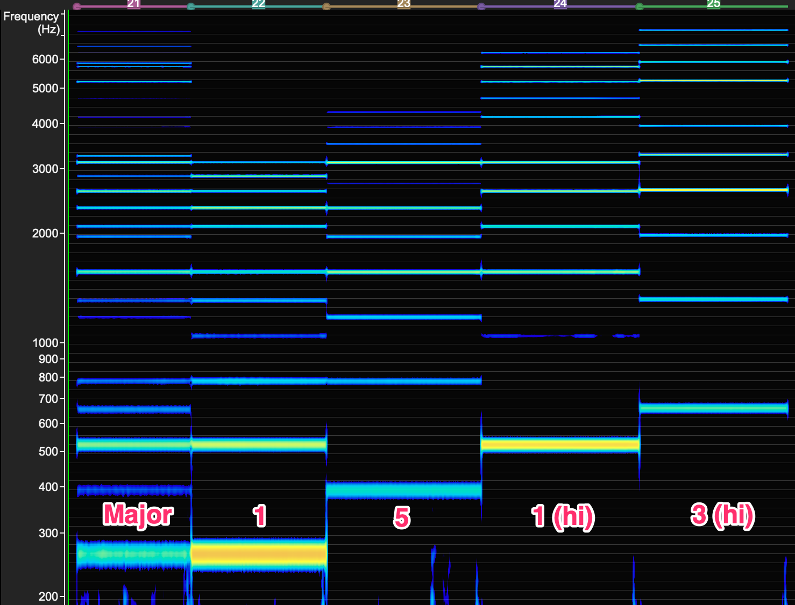
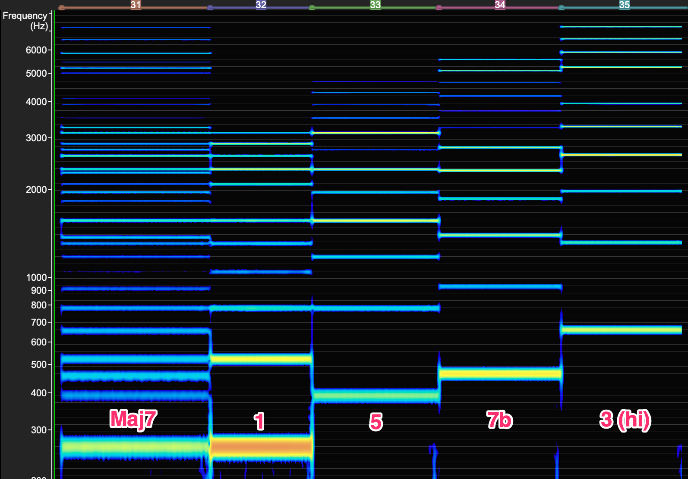
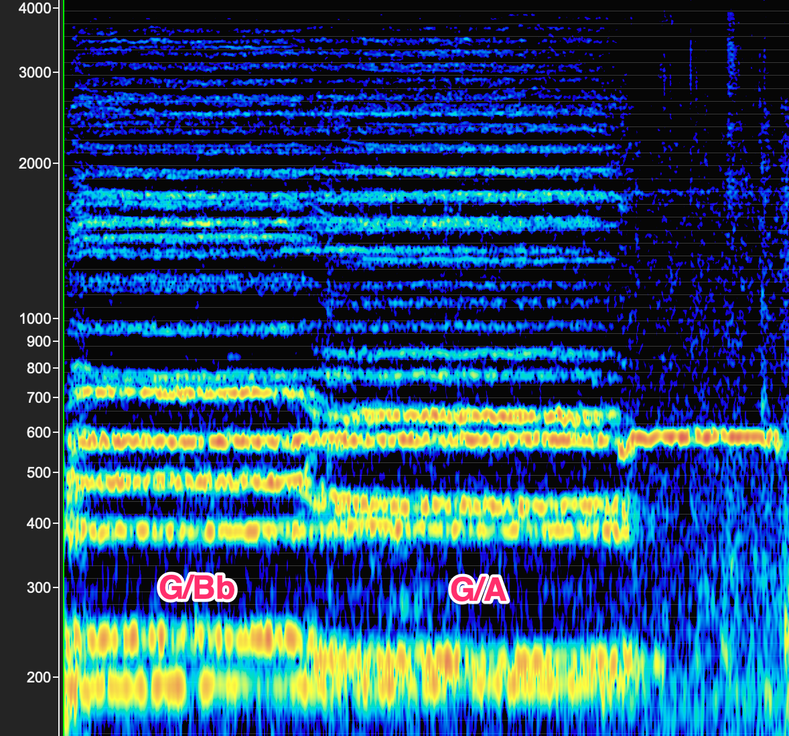
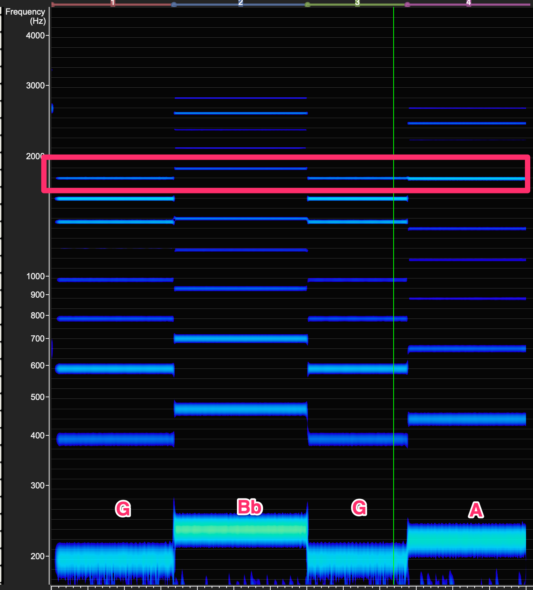

## VoceVista Barbershop samples

This is mostly a collection of barbershop samples used to help study with VoceVista.

Same passage of the same song in the same key. Left is a Top 50 quartet, Right is a Top 10 quartet:


Forefront singing Cat Car Caught together and then randomly: [video](https://www.youtube.com/watch?v=sgxx5S6nN5w&t=4m05s)


Major chord followed by each note individually on a drone.
This can be used to see which upper harmonic to focus on for tuning.



Same as above but a Major 7 (barbershop 7).



### Ambassadors of Harmony 

[Tuning Overtones](https://www.youtube.com/watch?v=sCdQVqQXkzc&t=15s)

Here we have a G/Bb and then a G/A. Here is the chorus in VoceVista



Here we have the same passage but played on a drone for each pitch. Note that on the G/A clash, they share an overtone around 1760 Hz (D6)




### Personal formant mapping

Measured using vocal fry on the following words (taken from [these exercises](docs/exercises.df))

```
Beet Bat      Bought (aw) Book 
Bit  But      Boat        Burt 
Bet  Bite     Boyd        Beaut 
Bait Bot (ah) Bout        Boot
```

My personal F1 vs F2 chart is below:

[f1f2](PersonalRecordings/F1F2.png)

[Google sheets](https://docs.google.com/spreadsheets/d/1fNc0Kbf_GSXRq0rsk7H98FTiiYq-U10lMulJl6TraBk/edit?usp=sharing)

### Measuring formants

Using the `Analysis` window in VoceVista, select a region of vocal fry on a given vowel. The average peaks are given in a tabular view, which can then be copied over to a Google Sheets for a graph.

[measuring](PersonalRecordings/measuring-formants.png)
